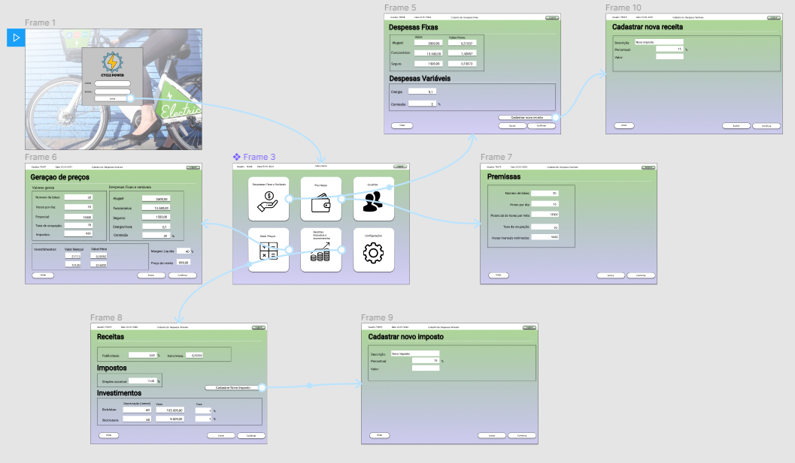
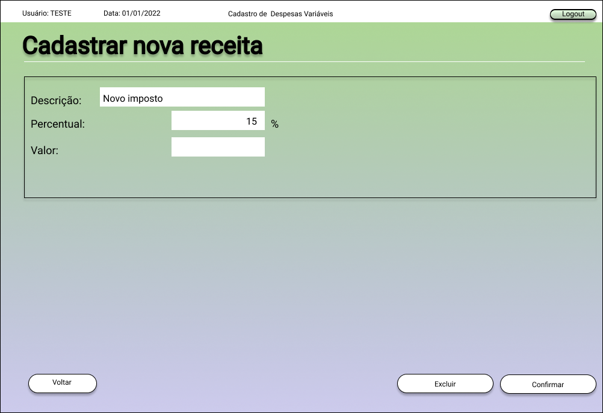
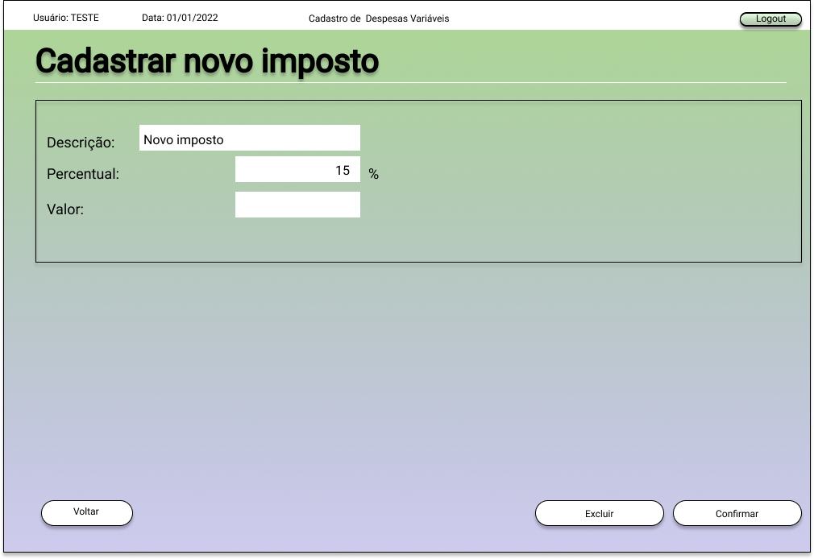

# Projeto de Interface

Pré-requisitos: <a href="2-Especificação do Projeto.md"> Documentação de Especificação</a>

Visão geral da interação do usuário pelas telas do sistema e protótipo interativo das telas com as funcionalidades que fazem parte do sistema (wireframes).

 Apresente as principais interfaces da plataforma. Discuta como ela foi elaborada de forma a atender os requisitos funcionais, não funcionais e histórias de usuário abordados nas <a href="2-Especificação do Projeto.md"> Documentação de Especificação</a>.
 
## Userflow

O aplicativo foi pensado para ter telas simples e amigáveis ao usuário durante o cadastro e processamento da precificação. Inicialmente, após o login o usuário terá multiplas opções e poderá inclusive efetuar o cadastro de impostos de maneira simples e fácil. 

## WireFrames

Tela de login que terá opções de preenchimento de usuário e senha por parte do usuário.

 
 O menu principal será responsável por apresentar todas as opções de caminho disponíveis ao usuário dentro do aplicativo.
 
 
 
 A rotina de geração de preços será responsável por efetuar o cálculo com base nos registros previamente cadastrados e parâmetros inseridos.
 
 
 
 Durante o cadastro das premissas será possível informar valores para os principais atributos de precificação.
 
 
 
 Tela de cadastro das despesas fixas/variáveis que circularão no aplicativo.
 
  
 
 Tela responsável pela visualização e seleção de impostos previamente cadastrados
 
 
 
 Tela que terá a opção de cadastro de nova receita.
 
 
 
 Tela com opção de inclusão de novos impostos.
 
 

